# 🎯 Automated Contribution Animation Setup

This repository now includes GitHub Actions automation to generate your contribution animation automatically, just like the snake animation!

## 🚀 How it works

1. **GitHub Actions runs daily** and on every push to main branch
2. **Fetches your real contribution data** from GitHub API  
3. **Generates animated SVG** with popping contribution boxes
4. **Auto-commits the SVG** back to your repository
5. **Your README displays** the always up-to-date animation

## 📁 Generated Files

The automation creates multiple SVG files:
- `{username}-contribution-animation.svg` - Personal filename
- `contribution-animation.svg` - Generic filename  
- `github-contribution-animation.svg` - Snake-style naming

## 🧩 How to Automate in Your Own Profile Repository

You can automate this in any repository (like your special `username/username` profile repo).

### Option 1: Using the GitHub Action (Recommended — No script files needed!)

Create `.github/workflows/generate-contribution-animation.yml` in your repository:

```yaml
name: Generate Contribution Animation

on:
  schedule:
    - cron: '0 0 * * *' # Daily at 00:00 UTC
  workflow_dispatch:
  push:
    branches: [ main ]

permissions:
  contents: write

jobs:
  generate:
    runs-on: ubuntu-latest
    steps:
      - name: Checkout repository
        uses: actions/checkout@v4

      - name: Generate Contribution Animation
        uses: Man0dya/Readme-Contribution-Graph-Generator@main
        with:
          github_user_name: ${{ github.repository_owner }}

      - name: Commit and push updated SVGs
        uses: stefanzweifel/git-auto-commit-action@v5
        with:
          commit_message: "chore: update contribution animation [skip ci]"
          file_pattern: "*-contribution-animation*.svg contribution-animation*.svg github-contribution-animation*.svg"
```

### Option 2: Using the Standalone Script

1. Copy `scripts/generate-svg.cjs` from this repo into your repository at `scripts/generate-svg.cjs`.
2. Create `.github/workflows/generate-contribution-animation.yml` and run `node scripts/generate-svg.cjs` with `env: GITHUB_TOKEN: ${{ secrets.GITHUB_TOKEN }}`.

---

## 🖼️ Embed in your README

Add either the auto dark/light picture tag or the direct markdown image:

**Auto Light/Dark Mode:**
```markdown
<picture>
  <source media="(prefers-color-scheme: dark)" srcset="github-contribution-animation-dark.svg" />
  
</picture>
```

**Single Theme:**
```markdown

```

## 🔧 Setup Instructions

### Option 1: Use in your own repository

1. **Copy the workflow file**:
   ```bash
   mkdir -p .github/workflows
   cp .github/workflows/generate-contribution-animation.yml .github/workflows/
   cp -r scripts/ ./
   ```

2. **Add to your README.md**:
   ```markdown
   
   ```

3. **Push to trigger first generation**:
   ```bash
   git add .
   git commit -m "Add automated contribution animation"
   git push
   ```

4. **Wait for GitHub Actions** to run (check Actions tab)

### Option 2: Use this repository's animation

Simply reference the animation from this repo in your README:

```markdown

```

## ⚙️ Customization

Edit `scripts/generate-svg.cjs` to customize:
- 🎨 **Colors**: Modify the `getContributionColor()` function
- ⏱️ **Animation speed**: Adjust `animationDuration` calculation  
- 📏 **Size**: Change `svgWidth` and `svgHeight`
- 🎭 **Animation style**: Modify CSS keyframes

## 🔄 Schedule

- **Daily at 00:00 UTC**: Automatic update
- **On every push**: Immediate update
- **Manual trigger**: From Actions tab

## 📊 Features

✅ **Real GitHub data** - Uses actual contribution counts  
✅ **Animated popping** - Contribution boxes explode in sequence  
✅ **Auto-updating** - Always shows latest contributions  
✅ **Zero maintenance** - Runs completely automatically  
✅ **Multiple formats** - Various filename options  
✅ **Fast loading** - Optimized SVG animations

---

🎯 Powered by: Contribution Animation (bubble‑shooter)