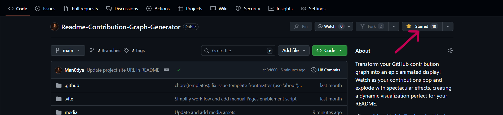

<div align="center">

# Readme Contribution Graph Generator

Turn your GitHub contribution graph into a playful bubble‑shooter animated SVG you can embed in your README. Generate once or keep it up to date automatically with GitHub Actions.

👉 Live app: https://man0dya.github.io/Readme-Contribution-Graph-Generator

</div>

---

<div align="center">

### You can add this animation to your profile readme 

Light Mode


Dark Mode



</div>

---

### Don't forget to star the repository



---

# For users

## How to add your animated contribution graph to your README

### 1. Easiest: Download and add manually

1. Go to the [Live App](https://man0dya.github.io/Readme-Contribution-Graph-Generator)
   
2. Enter your GitHub username and customize the animation (theme, speed, colors)
   
3. Click **Download Animated SVG** (or Static Graph SVG)
   
4. Save the SVG file (e.g. `github-contribution-animation.svg`) to the root of your repository
   
5. Add the following Markdown to your `README.md`: ( you can find this markdown on the app )

```markdown

```

Commit and push. Your animated graph will appear in your README!

---

### 2. Recommended: Automate daily updates with GitHub Actions

This keeps your graph up to date every day automatically.

**Step-by-step instructions:**

1. **Add the GitHub Actions workflow:**
   - In your repository (e.g. `username/username`), create `.github/workflows/generate-contribution-animation.yml`:

```yaml
name: Generate Contribution Animation

on:
  schedule:
    - cron: '0 0 * * *' # Daily at 00:00 UTC
  workflow_dispatch:
  push:
    branches: [ main ]

permissions:
  contents: write

jobs:
  generate:
    runs-on: ubuntu-latest
    steps:
      - name: Checkout repository
        uses: actions/checkout@v4

      - name: Generate Contribution Animation
        uses: Man0dya/Readme-Contribution-Graph-Generator@main
        with:
          github_user_name: ${{ github.repository_owner }}

      - name: Commit and push updated SVGs
        uses: stefanzweifel/git-auto-commit-action@v5
        with:
          commit_message: "chore: update contribution animation [skip ci]"
          file_pattern: "*-contribution-animation*.svg contribution-animation*.svg github-contribution-animation*.svg"
```

2. **Add the README snippet to display your graph:**
   - In your `README.md`, add:

```markdown
<picture>
  <source media="(prefers-color-scheme: dark)" srcset="github-contribution-animation-dark.svg" />
  
</picture>
```

3. **Check repo permissions:**
   - Go to **Settings > Actions > General > Workflow permissions**
   - Select **Read and write permissions**
   - Save changes.

4. **Trigger or wait for midnight:**
   - Trigger the workflow from the Actions tab (*Run workflow*), or simply push a commit. The SVG will be generated and committed automatically to your repository root!

---

### Troubleshooting

- **Image doesn’t appear:** Make sure the SVG file is committed to the same branch as your README and the filename matches.
  
- **Not updating daily:** Check the Actions tab for workflow runs. Branch protection may block workflow commits.
  
- **Private activity:** Only public contributions are shown.
---

## For developers

### Requirements
- Node.js 18+ (20 LTS recommended)
- npm

### Local development

```powershell
# Install dependencies
npm install

# Start dev server (Vite)
npm run dev
# App will open at http://localhost:3000

# Build production bundle
npm run build

# Preview the production build locally
npm run preview
```

### Deploying to GitHub Pages

This repo contains a GitHub Actions workflow at `.github/workflows/deploy.yml` that builds and publishes `dist/` to the `gh-pages` branch on push to `main`.

- Project site URL: `https://Man0dya.github.io/Readme-Contribution-Graph-Generator/`
- Vite base is set to `/Readme-Contribution-Graph-Generator/` in `vite.config.js` so assets resolve under the repo path.
- If you fork and rename the repository, update `base` accordingly.

### Project structure

```
Readme-Contribution-Graph-Generator/
├─ .github/workflows/
│  ├─ deploy.yml                         # Pages deployment (builds and publishes dist)
│  └─ generate-contribution-animation.yml # Daily SVG generator workflow
├─ public/
│  └─ favicon.svg
├─ scripts/
│  └─ generate-svg.cjs                   # CLI generator for automated SVGs
├─ src/
│  ├─ App.jsx
│  ├─ index.css
│  ├─ main.jsx
│  ├─ components/
│  │  ├─ CodeGenerator.jsx               # Customization, downloads, README snippets
│  │  ├─ Footer.jsx
│  │  ├─ Header.jsx
│  │  └─ UsernameForm.jsx                # Username input + validation
│  └─ utils/
│     ├─ debug.js
│     └─ github.js                       # Fetch/parse contribution data
├─ index.html
├─ package.json
├─ tailwind.config.js
├─ postcss.config.js
└─ vite.config.js
```

### How data fetching works

The client tries multiple approaches to derive your contribution calendar:
- Parse GitHub’s public contribution graph HTML via safe CORS proxies
- Use public activity feeds and repo activity to estimate contributions when needed
The resulting 53‑week grid drives both the animated and static SVG outputs.

### Scripts

```powershell
npm run dev        # Start development server
npm run build      # Build for production (dist/)
npm run preview    # Preview dist locally
npm run deploy     # Publish dist to gh-pages
npm run lint       # Lint
```

### Notes for forks

- Update `vite.config.js` base to your repository name (e.g., `/my-fork-name/`) so GitHub Pages serves assets correctly.
- The deployment workflow assumes the default branch is `main`; adjust if yours differs.

---

## Contributing

Contributions are welcome! Please read our [Contributing Guide](./CONTRIBUTING.md) and follow the [Code of Conduct](./CODE_OF_CONDUCT.md). Use our [issue templates](./.github/ISSUE_TEMPLATE) and [pull request template](./.github/pull_request_template.md) to streamline reviews.

## Security

Please report vulnerabilities privately. See [SECURITY.md](./SECURITY.md) for our policy and response timelines.

## License

MIT — see [LICENSE](./LICENSE).

## Acknowledgments

- Inspired by the fun of GitHub profile animations (e.g., snake)
- Thanks to the React, Vite, Tailwind, and Framer Motion communities

## Support

- Open issues and feature requests on the repository
- Star the project if it helps your profile shine ✨
