<div align="center">

# Readme Contribution Graph Generator

Turn your GitHub contribution graph into a playful bubble‑shooter animated SVG you can embed in your README. Generate once or keep it up to date automatically with GitHub Actions.

👉 Live app: https://man0dya.github.io/Readme-Contribution-Graph-Generator

</div>

---





---

## For users

## How to add your animated contribution graph to your README

### 1. Easiest: Download and add manually

1. Go to the [Live App](https://man0dya.github.io/Readme-Contribution-Graph-Generator)
2. Enter your GitHub username and customize the animation (theme, speed, colors)
3. Click **Download Animated SVG** (or Static Graph SVG)
4. Save the SVG file (e.g. `github-contribution-animation.svg`) to the root of your repository
5. Add the following Markdown to your `README.md`:

```markdown

```

Commit and push. Your animated graph will appear in your README!

---

### 2. Recommended: Automate daily updates with GitHub Actions

This keeps your graph up to date every day, with no manual steps.

**Step-by-step instructions:**

1. **Copy the generator script:**
    - Download or copy `scripts/generate-svg.cjs` from this repo or the app (see "Automate in your own repo" section).
    - Place it in your repo at `scripts/generate-svg.cjs`.

2. **Add the GitHub Actions workflow:**
    - Download or copy `.github/workflows/generate-contribution-animation.yml`from this repo or the app (see "Automate in your own repo" section).
    - Create a new file at `.github/workflows/generate-contribution-animation.yml` in your repo.
    - Paste the workflow:

3. **Commit and push both files.**
    - The workflow will run automatically every day and on pushes, updating your SVGs in the repo root.

4. **Add the README snippet to display your graph.**

    - Download or copy README snippet from the app and add it to your readme.
    - Commit changes. 

---

### Troubleshooting

- **Image doesn’t appear:** Make sure the SVG file is committed to the same branch as your README and the filename matches.
- **Not updating daily:** Check the Actions tab for workflow runs. Branch protection may block workflow commits.
- **Private activity:** Only public contributions are shown.

---

## For developers

### Requirements
- Node.js 18+ (20 LTS recommended)
- npm

### Local development

```powershell
npm install
npm run dev      # Start Vite dev server at http://localhost:3000
npm run build    # Build production bundle
npm run preview  # Preview production build locally
```

### Deploying to GitHub Pages

This repo contains a workflow at `.github/workflows/deploy.yml` that builds and publishes `dist/` to the `gh-pages` branch on push to `main`.

- Project site URL: `https://<user>.github.io/Readme-Contribution-Graph-Generator/`
- Vite base is set to `/Readme-Contribution-Graph-Generator/` in `vite.config.js`.
- If you fork/rename, update `base` accordingly.

Manual publish:

```powershell
npm run build
npm run deploy   # uses gh-pages to publish ./dist to gh-pages
```

### Project structure

```
Readme-Contribution-Graph-Generator/
├─ .github/workflows/
│  ├─ deploy.yml
├─ public/
│  └─ favicon.svg
├─ scripts/
│  └─ generate-svg.cjs
├─ src/
│  ├─ App.jsx
│  ├─ index.css
│  ├─ main.jsx
│  ├─ components/
│  │  ├─ CodeGenerator.jsx
│  │  ├─ Footer.jsx
│  │  ├─ Header.jsx
│  │  ├─ Hero.jsx
│  │  └─ UsernameForm.jsx
│  └─ utils/
│     ├─ debug.js
│     └─ github.js
├─ index.html
├─ package.json
├─ tailwind.config.js
├─ postcss.config.js
└─ vite.config.js
```

### How data fetching works

The client tries multiple approaches to derive your contribution calendar:
- Parse GitHub’s public contribution graph HTML via safe CORS proxies
- Use public activity feeds and repo activity to estimate contributions when needed
The resulting 53‑week grid drives both the animated and static SVG outputs.

### Scripts

```powershell
npm run dev        # Start development server
npm run build      # Build for production (dist/)
npm run preview    # Preview dist locally
npm run deploy     # Publish dist to gh-pages
npm run lint       # Lint
```

### Notes for forks

- Update `vite.config.js` base to your repository name (e.g., `/my-fork-name/`) so GitHub Pages serves assets correctly.
- The deployment workflow assumes the default branch is `main`; adjust if yours differs.

### Automate it in your own repo (daily refresh)

This project provides:
- scripts/generate-svg.cjs — a Node script that fetches your real contribution data and writes SVGs
- A ready‑to‑use GitHub Actions workflow YAML

Steps:
1) Create scripts/generate-svg.cjs in your repo and copy the script content from this repo or from the app’s “Automate in your own repo” section.
2) Create .github/workflows/generate-contribution-animation.yml and paste the workflow from the app (or adapt to your needs).
3) Commit and push. The workflow will:
   - Run on push, manual dispatch, and nightly (00:00 UTC)
   - Use the built‑in GITHUB_TOKEN—no PAT required
   - Commit updated SVGs to your repository root
4) Add the README snippet, for example:

```markdown

```

Tip: The app can also generate a <picture> snippet for automatic light/dark mode.

### Troubleshooting

- Image doesn’t appear: ensure the SVG file was committed to the same branch your README is on and the relative path matches.
- Not updating daily: check the Actions tab for the “Generate Contribution Animation” workflow run; branch protection might block commits from workflows.
- Private activity: the generator uses public signals; fully private activity is not included.

---

## For developers

### Requirements
- Node.js 18+ (20 LTS recommended)
- npm

### Local development

```powershell
# Install dependencies
npm install

# Start dev server (Vite)
npm run dev
# App will open at http://localhost:3000

# Build production bundle
npm run build

# Preview the production build locally
npm run preview
```

### Deploying to GitHub Pages

This repo contains a GitHub Actions workflow at `.github/workflows/deploy.yml` that builds and publishes `dist/` to the `gh-pages` branch on push to `main`.

- Project site URL: `https://<user>.github.io/Readme-Contribution-Graph-Generator/`
- Vite base is set to `/Readme-Contribution-Graph-Generator/` in `vite.config.js` so assets resolve under the repo path.
- If you fork and rename the repository, update `base` accordingly.

Optional manual publish if you prefer pushing from your machine:

```powershell
npm run build
npm run deploy   # uses gh-pages to publish ./dist to gh-pages
```

### Project structure

```
Readme-Contribution-Graph-Generator/
├─ .github/workflows/
│  ├─ deploy.yml                         # Pages deployment (builds and publishes dist)
├─ public/
│  └─ favicon.svg
├─ scripts/
│  └─ generate-svg.cjs                   # CLI generator for automated SVGs
├─ src/
│  ├─ App.jsx
│  ├─ index.css
│  ├─ main.jsx
│  ├─ components/
│  │  ├─ CodeGenerator.jsx               # Customization, downloads, README snippets, workflow/script copy
│  │  ├─ Footer.jsx
│  │  ├─ Header.jsx
│  │  ├─ Hero.jsx
│  │  └─ UsernameForm.jsx                # Username input + validation
│  └─ utils/
│     ├─ debug.js
│     └─ github.js                       # Fetch/parse contribution data (multiple strategies)
├─ index.html
├─ package.json
├─ tailwind.config.js
├─ postcss.config.js
└─ vite.config.js
```

### How data fetching works (overview)

The client tries multiple approaches to derive your contribution calendar:
- Parse GitHub’s public contribution graph HTML via safe CORS proxies
- Use public activity feeds and repo activity to estimate contributions when needed
The resulting 53‑week grid drives both the animated and static SVG outputs.

### Scripts

```powershell
npm run dev        # Start development server
npm run build      # Build for production (dist/)
npm run preview    # Preview dist locally
npm run deploy     # Publish dist to gh-pages (optional local path)
npm run lint       # Lint
```

### Notes for forks

- Update `vite.config.js` base to your repository name (e.g., `/my-fork-name/`) so GitHub Pages serves assets correctly.
- The deployment workflow assumes the default branch is `main`; adjust if yours differs.

---

## Contributing

Contributions are welcome! Please read our [Contributing Guide](./CONTRIBUTING.md) and follow the [Code of Conduct](./CODE_OF_CONDUCT.md). Use our [issue templates](./.github/ISSUE_TEMPLATE) and [pull request template](./.github/pull_request_template.md) to streamline reviews.

## Security

Please report vulnerabilities privately. See [SECURITY.md](./SECURITY.md) for our policy and response timelines.

## License

MIT — see [LICENSE](./LICENSE).

## Acknowledgments

- Inspired by the fun of GitHub profile animations (e.g., snake)
- Thanks to the React, Vite, Tailwind, and Framer Motion communities

## Support

- Open issues and feature requests on the repository
- Star the project if it helps your profile shine ✨